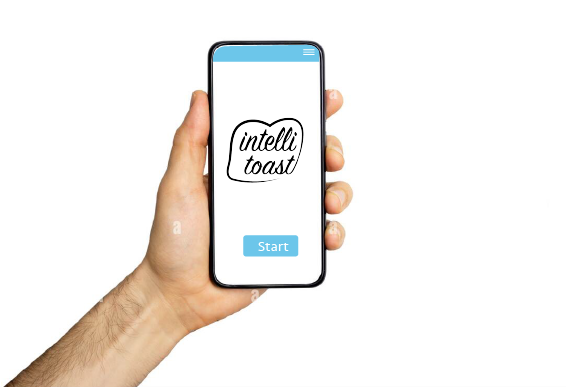
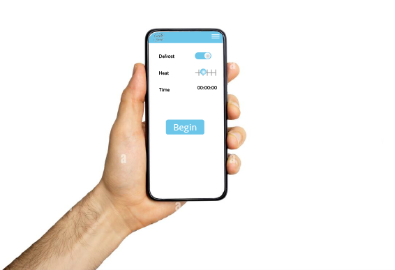
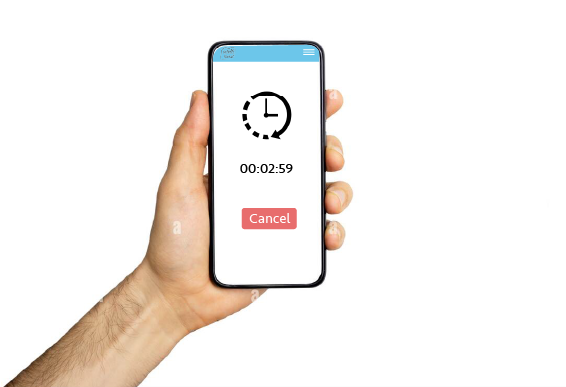
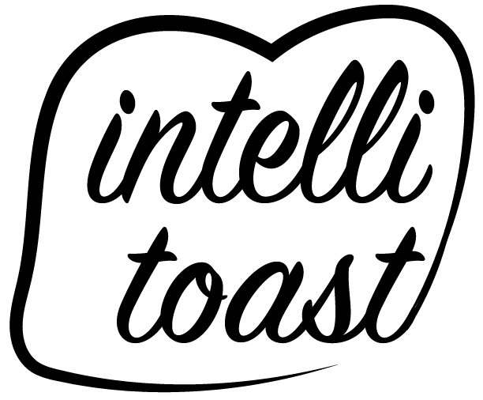

# Mysa Assessment

The following is my submission for the Mysa assessment. You can find each section as follows:

### 1. Requirements Analysis

The requirements analysis can be found in the `documents` folder located inside this project.

### 2. UI Concepts

You can find the image files inside the `images` folder located inside this project.

This is the intro screen from which you start the app and toaster.

This screen is the main menu that contains customizable options for your toasting expereince.

Here we have a countdown timer screen.

### 3. Unit Testing
The testing portion of this assessment can be found in the `tests` directory located in this project.

### 4. Code Review
The code review can be found on GitHub at the following URL:
https://github.com/Americanadian/mysa-assessment/pull/1

The review is located inside a PR off `main`.

My approach to providing feedback:

1) Be polite.  Sometimes their solution isn't "wrong", it could perhaps be improved upon.
2) Ask questions rather than offering an obvious solution.
3) Provide resources for further education. 

### 5. The New Hire
My assessment of the candidates can be found in the `documents` folder located inside this project.

### 6. Product Name and Logo

